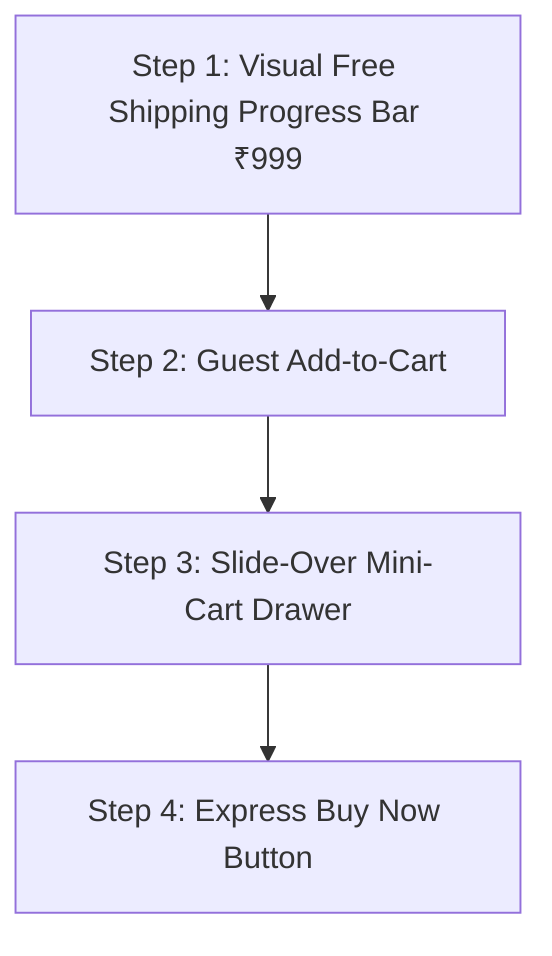

# Purchase Journey & Checkout Optimization Plan

This document outlines the step-by-step roadmap to enhance Sera's purchasing experience on **localhost**, moving sequentially one step at a time.

---

## Roadmap Overview

---

## Step 1: Visual Free Shipping Progress Bar (₹999 Threshold) - Current Focus

*(Note: Delivery date estimation is omitted per user instruction — leaving delivery timeline handling as originally configured.)*

### Free Shipping Progress Bar (₹999 Threshold)
- **The Concept**: Sera offers free shipping on orders above ₹999 (otherwise ₹100 shipping fee applies).
- **How it works**:
  - If cart subtotal < ₹999:
    - Display an animated progress bar: `Add INR [999 - subtotal] more for FREE Shipping! 🚚`
  - If cart subtotal >= ₹999:
    - Display a celebratory badge: `🎉 You have unlocked FREE Shipping!`
- **Locations**:
  - At the top of the Order Summary on both `Cart.jsx` and `Checkout.jsx`.

---

## Step 2: Guest Add-to-Cart (Upcoming Step)
- Allow visitors to add products to their cart without forcing an immediate redirect to `/login`.
- Store guest items in `localStorage` (`guestCart`).
- Sync guest cart with MongoDB automatically upon login or checkout.

---

## Step 3: Slide-Over Mini-Cart Drawer (Upcoming Step)
- When a user clicks "Add to Cart", instead of a small toast, slide out a luxury drawer from the right.
- Shows newly added item, Free Shipping progress bar, finishing touch add-ons, and instant "Checkout" CTA without navigating away.

---

## Step 4: Express "Buy Now" CTA (Upcoming Step)
- Add a secondary button next to "Add to Cart" on `ProductDetails.jsx` that takes impulse buyers straight to `/checkout`.
